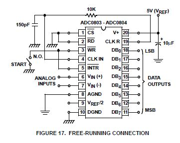
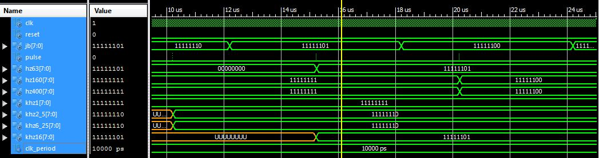
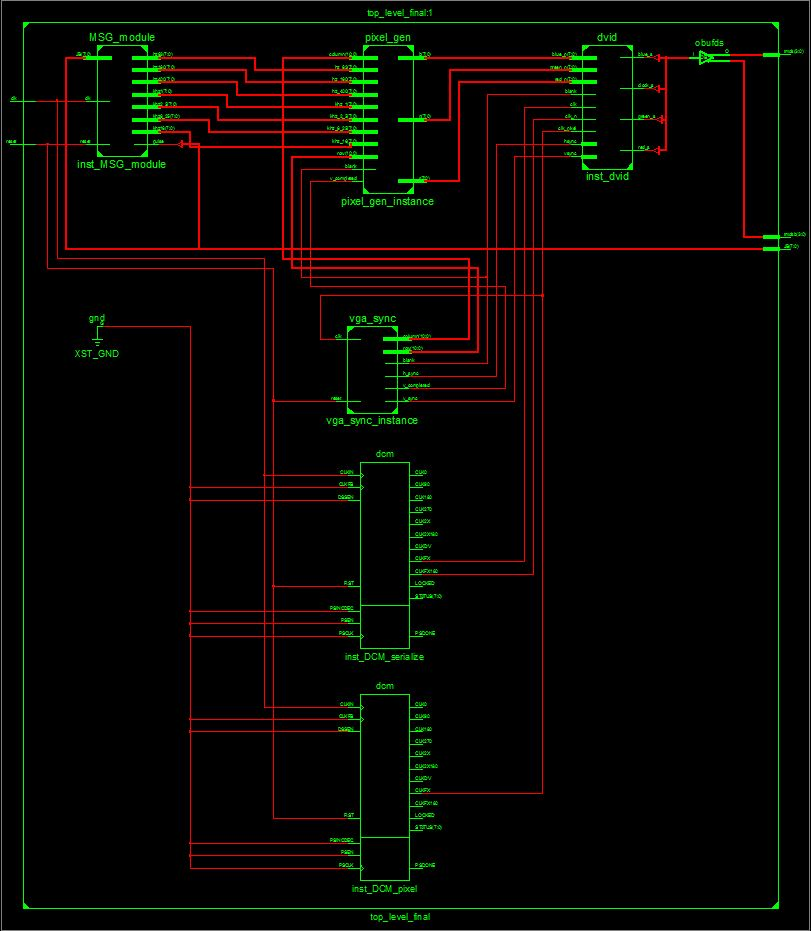

Lab_final
=========

This lab is the culminating lab for ECE 383. I will attempt to utilize everything taught in the course to derive my functionality. I will be creating a Graphic Equilizer using the MSGEQ7 chip from sparkfun.com. The block diagram and pinout is as follows:

Using the VGA controller we developed in Lab 1, I will be placing a bar graph representing voltage levels of different frequency levels on the desktop monitor display. I will use the skills taught in Lab 2 to make the bar graph update with the v_pulse signal. This will allow me to show a real time feed of what the voltage levels of the different frequency bands for the given input source look like. Lab 3 was mostly about timing signals to make sure different parts received the correct signals at the correct time. Due to the way the MSGEQ7 chip is built, timing will be very important. As the following diagram shows, I have very tight tolerances to get my chip to reset and output correctly.

I will probably use a large margin of error to pulse the MUX in the MSGEQ7 chip. Because the chip can switch very rapidly (13.888KHz to be exact), I will not need to approach the minimum pulse width of the chip to get a fluid output to the display. I will try to run the display at around 60Hz which would require a pulse width of apporximately 15ms. this gives me a margin of error of 231.46. The multiplexor description and block diagram is as follows:

Lab 4 was focused on implementing a softcore processor in the FPGA. I am hoping to use these skills for my A functionality requirement. I will need to create a digital filter to normalize the frequency bands. This should be easier to do with a processor at my disposal. The difficult part of this section will be instantiating the hardware to run the chip into the ISE design suite. 

## Prelab

- Submit project proposal to Capt Branchflower and get approval on Lesson 21
- Start ordering parts through Mr. Evans

## Required Functionality

Required functionality will require me to take in a line level signal, then output a graphical display of the peak voltage levels for the different frequency bands. In other words, I will be creating a Graphic Equalizer.

- Interface the MSGEQ7 chip with the FPGA
- Interface MSGEQ7 chip with input audio signal
- Output graphical display of peak voltage levels in real time for different frequency bands

## B Functionality

B functionality will require me to interface the MSGEQ7 chip with a microphone instead of a line level input.

- interface MSGEQ7 chip with microphone

**NOTE:** this step will require the use of an op amp in order to power and normalize the signal of the microphone.

## A Functionality

A functionality should take in an audio signal at line level to the FPGA. It should then output that same audio signal on the FPGA. I shold be able to play pink noise at the press of a button. The microphone will listen for this pink noise and analyze the peak voltages for the frequency bands. It should then normalize the frequency bands to match the pink noise signals by creating digital filters. these digital filters should be used to filter the incoming audio signal in real time, then output the filtered signal. 

- Connect the audio input on the FPGA 
- Output the audio on the FPGA
- Instantiate ROM that contains a pink noise signal
- Create filters from pink noise
- Filter incoming audio signal and output in real time

## Grading

| Prelab | **On-Time:** 0 ---- Check Minus ---- Check ---- Check Plus | | 10 | | BOC L21 |

| Required Functionality | **On-Time** --------------------------------- **Late:** 1Day ---- 2Days ---- 3Days ---- 4+Days| | 50 | | COB L40 |

| B Functionality | **On-Time** -------------------------------------------- **Late:** 1Day ---- 2Days ---- 3Days ---- 4+Days| | 10 | | COB L40 |

| A Functionality | **On-Time** -------------------------------------------- **Late:** 1Day ---- 2Days ---- 3Days ---- 4+Days| | 5 | | COB L40 |

| Use of Git / Github | **On-Time:** 0 -- Check Minus -- Check -- Check Plus -- **Late:** 1Day -- 2Days -- 3Days -- 4+Days| | 5 | | COB L40 |

| Code Style | **On-Time:** 0 -- Check Minus -- Check -- Check Plus -- **Late:** 1Day -- 2Days -- 3Days -- 4+Days| | 5 | | COB L40 |

| README | **On-Time:** 0 -- Check Minus -- Check -- Check Plus -- **Late:** 1Day -- 2Days -- 3Days -- 4+Days| | 25 | |COB L40 |

| **Total** | | | **100** | | |

## Design

In order to interface the MSGEQ7 chip with my Atlys board, I must take a DC signal and convert it to an unsigned signal. This requires the use of an analog to digital converter (ADC). Unfortunately, there is not one built into the chip. There is one that is located in the audio codex, but it is unusable for my purpose. Because of that, I had to use an off board ADC. I will utilize the ADC0803LCN ADC in a free running connection wiring. the diagram for the wiring is as follows:

I will run this chip into my board. I am running through the Vmod 8 GPIO connection onboard the ATLYS. I need one out for pulse and the rest will be in. I will place the pulse on the LSB and will make the entire port an inout. That way, when I read from the port, I can read all 8 bits. Though the LSB wont always be accurate, it doesnt matter because my resolution is not that precise.

## Debug

I created the hardware for running my MSGEQ7 chip, however during the testing phase, I am setting two inputs at a time instead of one. I am not sure why.

